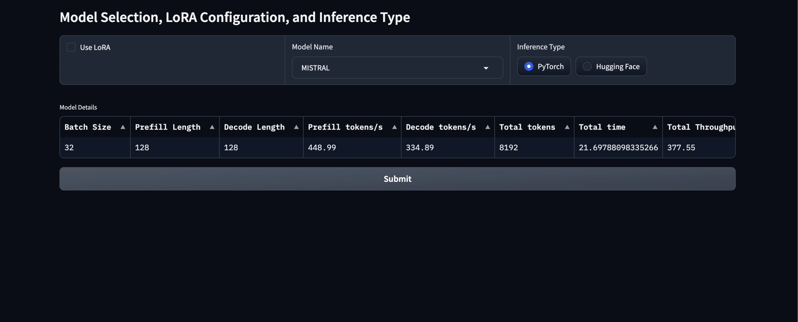

# 🚀 LLM Inference Optimization using LoRA and AWQ

This repository contains an assignment focused on optimizing large language model (LLM) inference using low-rank adaptation (LoRA) and Automatic Weight Quantization (AWQ) techniques. The goal is to improve inference speed and efficiency while maintaining model performance.

## ✨ Features

- 🔧 **LoRA**: Low-Rank Adaptation for parameter-efficient fine-tuning of LLMs.
- ⚡ **AWQ**: Automatic Weight Quantization to reduce the model's memory footprint and speed up inference.
- 🧠 **PyTorch Implementation**: The notebook utilizes PyTorch for model loading, tokenization, and inference.

## 📂 Notebooks

- **Final_lora_fast_llm_aryan.ipynb**: The main notebook for inference optimization using LoRA and AWQ. It includes:
  - 📦 Setup for environment and dependencies.
  - 📝 Loading and tokenizing the model.
  - 🛠️ Applying optimizations such as LoRA and AWQ.
  - 📊 Benchmarking the optimized model for performance and inference speed.

## 🛠️ Installation

1. Clone the repository:
   ```bash
   git clone https://github.com/your-username/llm-inference-optimization.git
   cd llm-inference-optimization
   ```

2. Install the required dependencies:
   ```bash
   pip install -r requirements.txt
   ```

## 🚀 How to Use

1. Run the provided notebook:
   ### 🔗 Google Colab

    1. **Open in Colab**: Click the Colab button or upload the notebook at [Google Colab](https://colab.research.google.com/).
    2. **Enable GPU**: Go to **Runtime** > **Change runtime type** > select **GPU (T4)**.
    3. **Run** the notebook. If you encounter **OOM errors**, restart the kernel.
    
    ### 🔗 Kaggle
    
    1. **Upload to Kaggle**: Go to [Kaggle](https://www.kaggle.com/), create a new notebook, and upload `Final_lora_fast_llm_aryan.ipynb`.
    2. **Enable GPU**: Select **GPU (T4)** in the settings.
    3. **Run** the notebook. Restart the kernel if you hit an OOM issue.
    
    2. Follow the steps in the notebook to load the pre-trained LLM and apply LoRA and AWQ techniques for inference optimization.

## 📈 Results

- ⏱️ **Inference Speed**: The optimized model demonstrates significant improvements in inference time while keeping performance degradation minimal.
- 💾 **Memory Usage**: Memory requirements are reduced by applying AWQ, allowing for efficient deployment on smaller hardware.

## 📝 Requirements

- Python 3.8+
- PyTorch 2.0+
- `transformers`, `peft`, `awq`, `torchvision`, `pandas`, `numpy`, `psutil`

## 🔗 References

- [LoRA: Low-Rank Adaptation](https://arxiv.org/abs/2106.09685)
- [AWQ: Automatic Weight Quantization](https://github.com/mit-han-lab/llm-awq) 🌟

## 📸 Image and Drive Link
< a href = https://drive.google.com/file/d/12mpOL1n_c48qV99zXd4ir9hlboGcHAXV/view?usp=sharing">
  
</a>


              
## ⚖️ License

This project is licensed under the MIT License - see the [LICENSE](LICENSE) file for details.

